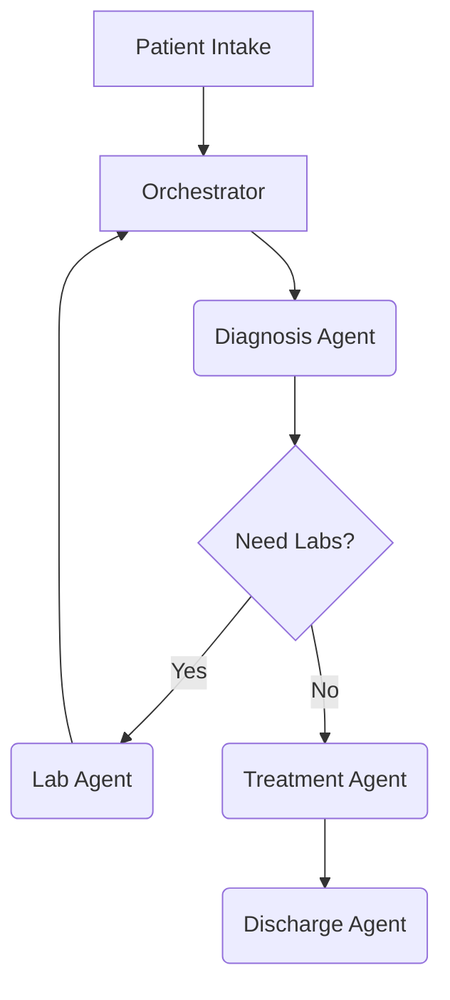

# Multi-Agent Hospital AI Architecture

## Overview
This platform coordinates multiple specialized AI agents (Diagnosis, Treatment, Billing, Intake) to manage a patient's end-to-end hospital journey.

## Core Components
- **Planner (Orchestrator)**: Uses an LLM to dynamically generate a workflow path (e.g., Intake -> Diagnosis -> Lab -> Billing).
- **BaseAgent**: A 15-step asynchronous pipeline that standardizes agent behavior (Input Normalization -> Context Hydration -> Tool Planning -> RAG Retrieval -> LLM Generation -> Output Validation).
- **ToolPlanner**: Executes requested tools in parallel utilizing `asyncio.gather` and `tenacity` for exponential backoff retries.
- **Vector Store**: A Hybrid FAISS + SQLite architecture. SQLite manages deduplication (SHA-256) and metadata, while FAISS manages L2 vector similarity search.
- **Multimodal Pipeline**: Dedicated modules for PyTesseract OCR, Whisper Audio, PyMuPDF, and pydicom.

## Workflow Example

## Security
- **RBAC**: Implemented via FastAPI dependencies.
- **Audit Logs**: Immutable PostgreSQL tables hashing every decision made by an AI agent.
- **Encryption**: AES encryption for PHI at rest using `cryptography.fernet`.
